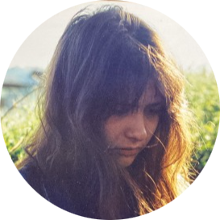

# Meme Editor

Create memes in browser

## Try it

```
chromium demo.html
```

## Install

```
npm install
```

## Start web server

Start web server. Default port is **3013**

```
npm run server
```

or use other port

```
PORT=5000 npm run server
```

[Open in browser](http://127.0.0.1:3013)

## Start desktop app

```
npm start
```

## Build

1. Install **webpack** globally if not installed already

```
npm install -g webpack
```

2. Build javascript code

```
npm run build
```

## Demo

[Open editor](https://www.sipme.io/memed)

## In Loving Memory of Marina Nedeva 💖

|  | This project is dedicated to the memory of Marina, my dearest friend, an extraordinary software developer, and a kind, inspiring soul who left an indelible mark on both this work and my life. <br><br> Her contributions to this project showcase her dedication to clean code, her problem-solving skills, and her commitment to excellence. Her friendship and professional brilliance will always be remembered. |
|------------------------------------------------------|-------------------------------------------------------------------------------------------------------------------------------------------


### Her Contribution

Marina was not just a collaborator; she was the heart of many of our ideas and innovations. Her exceptional skills in software development, her dedication to clean, efficient code, and her keen problem-solving abilities elevated every project we worked on together. 

She was more than a teammate; she was a visionary who approached every challenge with creativity and determination. Many features and functionalities of this project are a testament to her talent and perseverance. Her ability to simplify complex concepts and her passion for sharing knowledge made her an invaluable mentor and partner.

### Her Spirit

Beyond her technical brilliance, Marina was a source of light and positivity. She had a way of turning late-night coding sessions into cherished memories, filled with laughter, insight, and encouragement. Her kindness, patience, and empathy touched everyone who had the privilege of knowing her.

To me, she was not just a friend but a sister in spirit. She believed in lifting others up, celebrating their successes, and always pushing for excellence in everything she did.

### A Legacy of Friendship and Excellence

Though her time with us was far too short, Marina leaves behind a legacy of dedication, innovation, and friendship. This project, and so many others we collaborated on, are a reflection of her love for technology and her desire to make the world a better place through her work.

I hope that as you use and contribute to this project, you feel a sense of the passion and joy that she poured into it. Her work will continue to inspire and guide us, just as her friendship will always remain in our hearts.

---

May her memory live on through the code she crafted, the ideas she brought to life, and the lives she touched. 💖

## Donation

We hope you've found our software useful. As a non-profit organization, we rely on the generosity of people like you to continue our mission of creating free/OS software

If you've found our work valuable and would like to support us, please consider making a donation. Your contribution, no matter the size, will make a meaningful difference in the lives of those we serve

Thank you for considering supporting us. Together, we can make a positive impact on our community/world

[](https://www.paypal.com/cgi-bin/webscr?cmd=_s-xclick&hosted_button_id=XUSKMVK55P35G)
